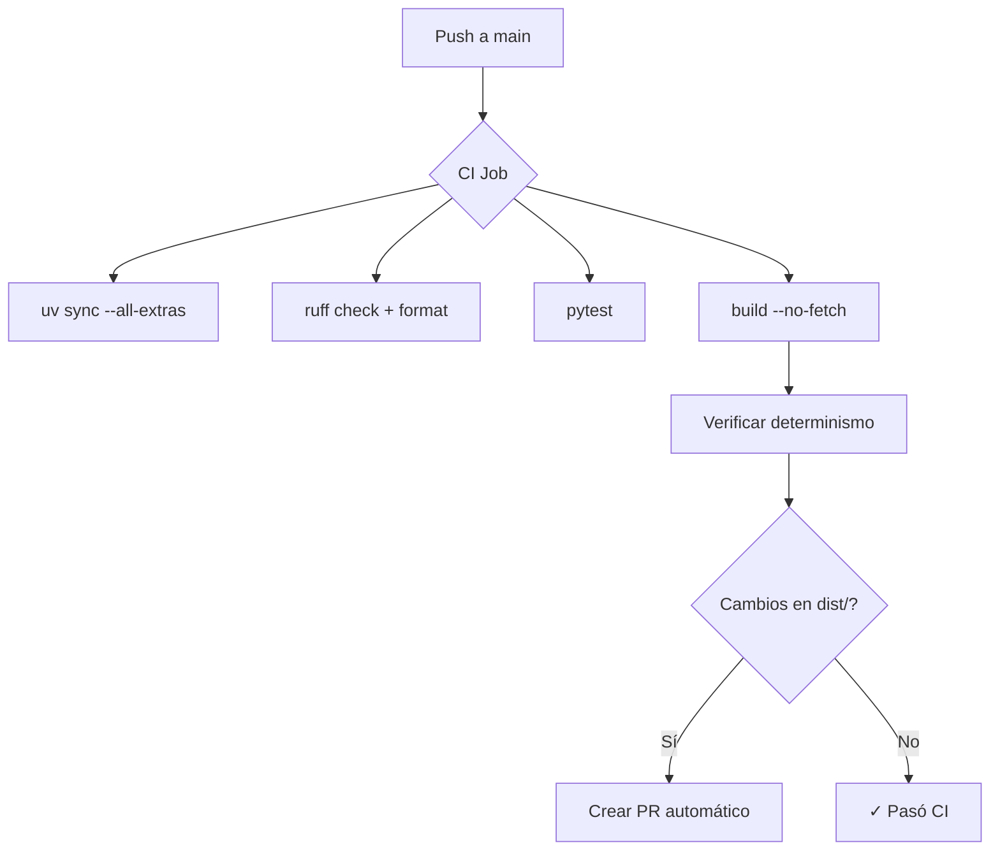

# Pi-hole Blocklist Factory

[](https://github.com/malpanez/pihole-blocklist-factory/actions/workflows/ci.yml)
[](https://github.com/malpanez/pihole-blocklist-factory/actions/workflows/build-lists.yml)
[](https://github.com/malpanez/pihole-blocklist-factory)
[](https://github.com/malpanez/pihole-blocklist-factory)
[](https://github.com/malpanez/pihole-blocklist-factory)

Herramienta de producción para construir, sanitizar y distribuir listas de bloqueo personalizadas para **Pi-hole v6** desde múltiples fuentes.

## Características

- **Múltiples parsers**: hosts (`0.0.0.0 domain`, `127.0.0.1 domain`, `::`) | domain-only | ABP simple (`||domain^`)
- **Sanitización estricta**: IDNA/punycode, validación FQDN, rechazo de IPs y single-label domains
- **Categorización**: malicious > tracking > advertising > suspicious > other > telemetry (con precedencia configurable)
- **Perfiles por dispositivo**: base, security, aggressive, android, ios, windows, macos, mobile, tablet
- **Modo strict/non-strict**: protege dominios core en perfiles no-strict
- **Fetch con caché**: ETag/Last-Modified, reintentos exponenciales, timeouts
- **Soporte para overlays privados**: `config/sources.local.yml` gitignored, drop_patterns, allowlist/denylist
- **Reportes**: stats.json/md, overlap, marginal, churn (en desarrollo)
- **CI determinista**: mismo input => mismo output (ordenado, normalizado)
- **Pre-commit hooks** + **ruff** (no black/isort, como está)

## Requisitos

- Python 3.11+ (recomendado 3.12)
- `uv` (gestor de dependencias)

## Setup local

```bash
git clone https://github.com/malpanez/pihole-blocklist-factory.git
cd pihole-blocklist-factory

# Instalar dependencias
uv sync --all-extras

# Validar código
uv run ruff check .
uv run ruff format .

# Tests
uv run pytest tests/
```

## Uso

### Build (offline con ejemplo local)

```bash
# Build usando sources locales (no fetcha URLs)
uv run blocklist-factory build --no-fetch

# Build con fetch (descarga desde URLs)
uv run blocklist-factory build

# Build mostrando JSON de stats
uv run blocklist-factory build --json
```

Outputs:
- `dist/all.txt` - todas los dominios únicos
- `dist/categories/{advertising,tracking,malicious,suspicious,other,telemetry}.txt`
- `dist/profiles/{base,security,aggressive,android,ios,windows,macos}.txt`
- `dist/reports/stats.json` y `stats.md`

### Validar configuración

```bash
uv run blocklist-factory validate
```

Verifica sintaxis de YAML y coherencia de categorías/perfiles.

### Ver reportes

```bash
uv run blocklist-factory report
```

Muestra stats del último build en JSON.

## Configuración

### 1. Fuentes (`config/sources.yml`)

Catálogo público de fuentes externas. Cada fuente tiene:

```yaml
sources:
  - id: firebog_malware
    name: "Firebog Malware List"
    category: malicious
    url: https://v.firebog.net/hosts/RPiList-Malware.txt
    enabled: true
    tier: stable  # stable | edge
    license: "MIT"
    notes: "Curated malware blocklist"
```

### 2. Fuentes privadas (`config/sources.local.yml` - gitignored)

Archivo **no versionado** para fuentes privadas/experimentales:

```yaml
sources:
  - id: my_internal_list
    name: "Mi Lista Interna"
    category: tracking
    url: file:///path/to/my/list.txt
    enabled: true
    tier: stable
```

Copiar de `config/sources.local.example.yml` y personalizar.

### 3. Políticas (`config/policies.yml`)

```yaml
policies:
  # Precedencia de categorías (primera = más prioritaria)
  category_precedence:
    - malicious
    - tracking
    - advertising
    - suspicious
    - other
    - telemetry

  # Dominios core que NO se bloquean en perfiles no-strict
  core_domains:
    - apple.com
    - google.com
    - microsoft.com

  # Dominios base que siempre están en allowlist
  base_allowlist: []
```

### 4. Perfiles (`config/profiles.yml`)

```yaml
profiles:
  base:
    include_categories: [advertising, tracking, malicious]
    include_sources: []  # vacío = todas las enabled
    exclude_sources: []
    strict: false  # respeta core_domains

  aggressive:
    include_categories: [advertising, tracking, malicious, telemetry]
    strict: true  # permite bloquear telemetry
```

### 5. Overrides

- **`inputs/current_overrides/allowlist.txt`** - dominios nunca a bloquear
- **`inputs/current_overrides/denylist_extra.txt`** - dominios forzadamente bloqueados
- **`inputs/current_overrides/drop_patterns.txt`** - regex patterns para descartar líneas (antes de parse)

### 6. Mis fuentes actuales

**`inputs/sources_current.txt`** - URLs de mis fuentes actuales (para referencia, no se procesa automáticamente).

## Importar desde Pi-hole v6

Si tienes un Pi-hole v6 con listas ya configuradas:

```bash
# Exportar desde Pi-hole (v6 API)
curl "http://pihole.local/api/adlists" \
  -H "Authorization: Bearer YOUR_API_KEY" | jq -r '.[] | .address' > inputs/sources_current.txt

# Luego, copiar URLs interessantes a config/sources.yml o config/sources.local.yml
```

O manualmente:
1. Admin Panel > Settings > Adlists
2. Copiar URLs de cada lista a `config/sources.yml`

## Flujo CI



## Flujo Update (semanal)

```mermaid
graph TD
    A[Scheduled workflow] --> B["build (con fetch)"]
    B --> C{Cambios en dist/?}
    C -->|Sí| D["Generar PR con:"]
    D --> E["- stats diff"]
    D --> F["- churn (nuevo vs anterior)"]
    D --> G["- marginal (contribución por fuente)"]
    C -->|No| H["✓ Sin cambios"]

## Cobertura dinámica (opcional)

Si quieres un badge dinámico con cobertura real:

1. Crear cuenta en Codecov y activar el repo.
2. Añadir el token `CODECOV_TOKEN` en GitHub → Settings → Secrets and variables → Actions.
3. Añadir un paso de upload en `.github/workflows/ci.yml`:

```yaml
- name: Upload coverage to Codecov
  uses: codecov/codecov-action@v5
  with:
    token: ${{ secrets.CODECOV_TOKEN }}
```

4. Reemplazar el badge estático por el de Codecov.
```

## Consumir blocklists

### Opción 1: Raw GitHub URLs

```
https://raw.githubusercontent.com/yourusername/pihole-blocklist-factory/main/dist/all.txt
https://raw.githubusercontent.com/yourusername/pihole-blocklist-factory/main/dist/profiles/base.txt
```

### Opción 2: Servidor local

```bash
# Servir desde carpeta dist
cd pihole-blocklist-factory
python3 -m http.server 8000 -d dist

# En Pi-hole, añadir adlist:
http://localhost:8000/all.txt
http://localhost:8000/profiles/base.txt
```

### Opción 3: file:// URLs (Pi-hole mismo servidor)

Si clonas el repo **en la misma máquina que Pi-hole**:

```
file:///home/malpanez/repos/pihole-blocklist-factory/dist/all.txt
```

## Mapeo de perfiles a Pi-hole Groups

En **Pi-hole v6 API**, cada adlist puede asignarse a múltiples **Groups**:

```bash
# Asignar all.txt a grupo "Default"
curl -X PUT "http://pihole.local/api/adlists/1" \
  -H "Authorization: Bearer YOUR_API_KEY" \
  -H "Content-Type: application/json" \
  -d '{"groups": [1]}'

# Asignar android.txt a grupo "Mobile"
curl -X PUT "http://pihole.local/api/adlists/2" \
  -H "Authorization: Bearer YOUR_API_KEY" \
  -H "Content-Type: application/json" \
  -d '{"groups": [3]}'
```

## Canales de distribución

- **`dist/stable/`** (futuro) - solo fuentes tier=stable, para uso en producción
- **`dist/edge/`** (futuro) - incluye tier=edge, experimental
- **Raw GitHub URLs** - apuntan a rama main (siempre actualizado)

## Arquitectura

```
src/blocklist_builder/
├── types.py           # Source, Provenance, Profile, SourceMetadata
├── config.py          # Carga YAML (sources.yml, profiles.yml, policies.yml)
├── fetch.py           # Descargas con caché, retries, metadata
├── parse.py           # Parsers: hosts, domain-only, ABP simple
├── sanitize.py        # Validación FQDN, IDNA, rechazo IPs
├── classify.py        # Categorización por precedencia, provenance
├── build.py           # Orquestación: fetch → parse → sanitize → classify → write
├── report.py          # Genera reportes (stats, overlap, churn)
└── cli.py             # CLI: build, validate, report, sync-*
```

## Roadmap

- [x] Parse múltiple (hosts, domain-only, ABP simple)
- [x] Sanitización estricta (IDNA, FQDN)
- [x] Profiles con include_categories
- [x] Fetch con caché
- [x] Config sources.local.yml (gitignored)
- [x] CLI: build, validate, report
- [ ] Provenance tracking por dominio
- [ ] Firebog sync
- [ ] GitHub catalog sync
- [ ] Overlap report (matriz de solapamiento)
- [ ] Marginal report (contribución neta por fuente)
- [ ] Churn report (delta vs build anterior)
- [ ] Release channels (stable/edge)
- [ ] Guardrails para core_domains
- [ ] GitHub Actions workflows (CI + Update)

## Licencias

- **Código**: MIT (ver `LICENSE`)
- **Listas externas**: Mantienen su propia licencia (ver `CREDITS.md`)

## Contribuciones

PRs bienvenidas. Por favor:
1. Mantén Python 3.11+ y ruff (no black/isort)
2. Añade tests para new features
3. Asegúrate que el build sea determinista
4. Documenta cambios en README

## Problemas comunes

### ❌ "Connection refused" en fetch

El `build` command por defecto descarga URLs. Usar `--no-fetch` para modo offline (con fuentes locales):

```bash
uv run blocklist-factory build --no-fetch
```

### ❌ "ModuleNotFoundError: yaml"

Instalar dev dependencies:

```bash
uv sync --all-extras
```

### ❌ Cambios en dist/* son inconsistentes

Verificar que no hay timestamps dentro de los archivos de output. Todos los ficheros deben generarse **idénticamente** con el mismo input.

## Contacto

- Issues/PRs: GitHub
- Docs: Ver `docs/pihole_integration.md`
